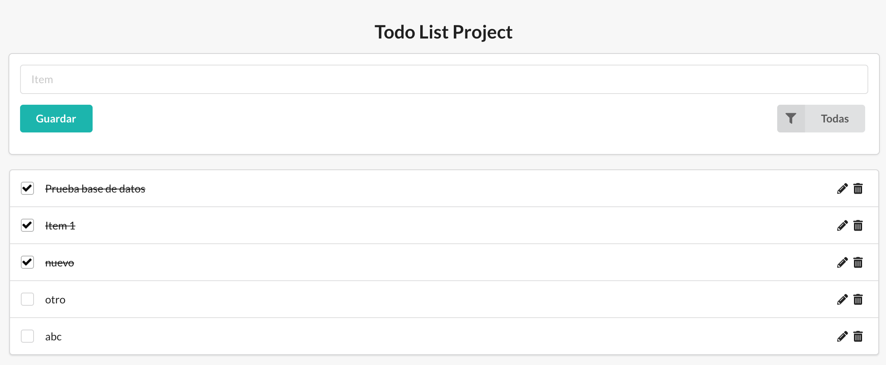

# Getting Started with Create React App

This project was bootstrapped with [Create React App](https://github.com/facebook/create-react-app).

## Available Scripts

In the project directory, you can run:

### `yarn dev`

Launches the server and the app in the development mode.\
Open [http://localhost:3000](http://localhost:3000) to view it in the browser.\
[http://localhost:8181](http://localhost:8181) server port.

### `yarn start`

Runs the app in the development mode.\
Open [http://localhost:3000](http://localhost:3000) to view it in the browser.

The page will reload if you make edits.\
You will also see any lint errors in the console.

### `yarn server`

Launches the server .\
[http://localhost:8181](http://localhost:8181) server port.
